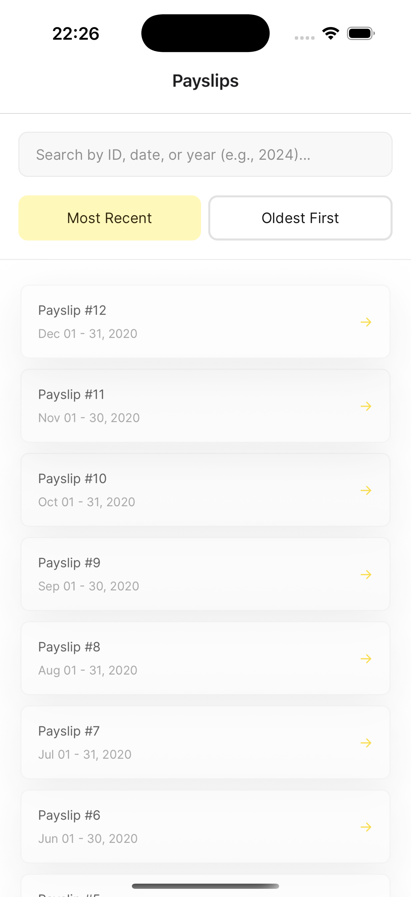
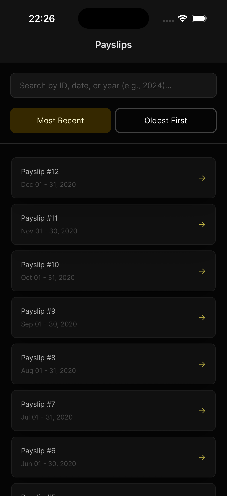

# Payslips App

## 📋 Table of Contents

- [Tech Stack](#-tech-stack)
- [Running the App](#-running-the-app)
- [Project Structure](#-project-structure)
- [Architecture](#-architecture)
- [Known Limitations](#known-limitations)

## 🛠 Tech Stack

- **React Native** (Expo SDK 54) - Cross-platform mobile framework
- **TypeScript** - Type-safe JavaScript
- **Expo Router** - File-based navigation system
- **TanStack Query** (React Query) - State management and data fetching
- **Tamagui** - Universal UI component library
- **Expo File System** - Native file operations
- **Expo Sharing** - Native file sharing/preview
- **Flash List** - High-performance list component
- **Husky** - Git hooks for pre-commit code quality checks

## 🚀 Running the App

1. **Clone the repository**
   ```bash
   git clone <repository-url>
   cd payslips-app
   ```

2. **Install dependencies**
   ```bash
   npm install
   ```

3. **Install iOS dependencies** (macOS only)
   ```bash
   cd ios && pod install && cd ..
   ```

 4. Start the Expo development server:
   ```bash
   npm start
   ```

## 📁 Project Structure

```
payslips-app/
├── app/                   # Expo Router pages (file-based routing)
│   ├── _layout.tsx        # Root layout with providers
│   ├── index.tsx          # Payslip list route
│   └── [id]/              # Dynamic payslip routes
│       ├── detail.tsx     # Payslip details route
│       └── preview.tsx    # PDF preview route
├── assets/                # Static assets (images, fonts, PDFs)
├── src/
│   ├── components/        # Reusable UI components
│   │   ├── Badge/        # Badge component system
│   │   ├── PayslipCard/  # Payslip card component system
│   │   ├── PayslipList/  # List component
│   │   └── PermissionModal/ # Permission request modal
│   ├── data/             # Mock data (payslips.json)
│   ├── pages/            # Screen components
│   │   ├── PayslipListScreen/
│   │   ├── PayslipDetailsScreen/
│   │   └── PDFPreviewPage/
│   ├── services/         # Business logic services
│   │   ├── fileService/  # File operations (download, preview)
│   │   ├── payslipService/ # Payslip data fetching/filtering
│   │   └── permissionsService/ # Android permissions
│   ├── hooks/            # Custom React hooks
│   │   ├── useColorScheme/ # Theme hook (with web variant)
│   │   └── useFilePermissions/ # File permission management hook
│   └── types/            # TypeScript type definitions
├── .eslintrc.js          # ESLint configuration
├── app.json              # Expo configuration
├── package.json          # Dependencies and scripts
├── tamagui.config.ts     # Tamagui theme configuration
└── tsconfig.json         # TypeScript configuration
```

## 🏗 Architecture

The architecture uses composition-based components, a pattern gaining popularity in the React Native community and used by companies such as Vercel and [Margelo](https://margelo.com/). Composition-based components offer a highly flexible approach to building reusable and maintainable components. You can learn more about this approach from Fernando Rojo’s talk. [Composition Is All You Need](https://www.youtube.com/watch?v=4KvbVq3Eg5w).

TanStack was chosen as an in-memory state management solution over Context/Redux because it provides built-in loading and error states, automatic caching and invalidation, far less boilerplate, and a better ability to separate data fetching from UI logic. It also offers a very simple approach to applying filters and sorting to the data set.

[Tamagui](https://tamagui.dev/) was chosen for its powerful multi-platform capabilities and excellent developer experience. Tamagui makes it easy to extend codebases to Web, iOS, Android, and more. Write once, run everywhere with a single codebase. This enables seamless cross-platform development without platform-specific UI code.

Tamagui comes with a robust theming system that brings features like **Dark Mode out of the box**:




Tamagui is optimized for rendering with style extraction and tree-shaking for minimal bundle size with full TypeScript support with excellent type inference.

Expo Router was chosen for its file-based routing system, type safety, deep linking support, and native integration, which works on multiple platforms with a single codebase.

**Code Quality**: The project uses Husky with lint-staged to enforce code quality standards. Before each commit, staged files are automatically linted with ESLint (with auto-fix) and type-checked with TypeScript, ensuring that only properly formatted and type-safe code enters the repository.

## Known Limitations

**Offline Support**: The app doesn't handle offline scenarios. All data is in-memory, so this is less critical, but network-dependent features (if added) would need offline handling. This could be easily implemented by extending to a tool such as TanStack DB, whicj ios one of the readsons I chosed TanStack Query for, that it could easily be extneded to support offline-first capabilities.

**Service Layer**: The service layer is currently a collection of exported functions, but it could be improved with more complex service-based patterns, better separation of concerns, and stronger OOP principles. For this demo and for simplicity, it has been kept as a simple layer of functions.

**Testing**: I added some basic Jest tests for the service layer, but a better testing approach would be to also use an end-to-end testing suite such as [Maestro](https://maestro.dev/cloud), which could test user flows, goals, and habits in the app to ensure user journeys are properly validated. Also, I only tested services that run JavaScript. This could be extended to test native module code in a Metro test runner environment using [react-native-testing-library](https://github.com/callstack/react-native-testing-library) but that is out of scope for this demo.
